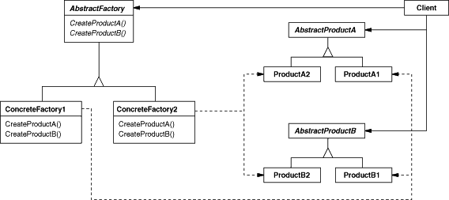

## 1\. 추상 팩토리(Abstract Factory) 패턴 이란?

> 추상 - 구체적으로 어떻게 구현되는지 생각하지 않고 인터페이스(API)에만 주목하는 상태  
> 공장 - 부품을 조립하여 제품 완성

**추상 + 공장 패턴 :** 추상적인 공장에서 추상적인 부품을 조합하여 추상적인 제품을 만든다. 부품의 구체적인 구현에 집중하지 않고 인터페이스에 주목, 인터페이스만 사용하여 부품을 조립하고 제품으로 완성한다.

다음 표를 보면 추상 팩토리가 어떤 구조로 이루어졌는지 확인할 수 있다.
<p align="center"></p>

-   **Abstract Factory :** 최상위 공장, 메서드들을 추상화한다. AbstractProduct의 인스턴스를 만들기 위한 인터페이스를 결정한다.
-   **Concrete Factory :** 서브 공장 클래스, 유형에 맞는 객체를 반환하도록 메서드들을 재정의한다. AbstractFactory의 인터페이스를 구현한다.
-   **Abstract Product :** 타입의 제품을 추상화한 인터페이스이다. AbstractFactory에 의해 만들어지는 추상적인 부품이나 제품의 인터페이스(API)를 결정한다.
-   **ConcreteProduct :** 각 유형의 구현체, 팩토리 객체로부터 생성한다. AbstractProduct의 인터페이스를 구현한다.

## 2\. 예제

사용할 예제는 계층 구조로 된 링크 페이지를 HTML파일로 바꾸는 코드이다. ("JAVA 언어로 배우는 디자인 패턴 입문 3편"의 예제 활용) HTML 계층 구조를 추상 팩토리 패턴을 통해 구현한 것으로 2개의 패키지로 분리된 클래스군으로 구성되어 있다.

-   **factory :** 추상적인 공장, 부품, 제품을 포함하는 패키지
-   **listFactory :** 구체적인 공장, 부품, 제품을 포함하는 패키지

factory 하위의 추상 공장/부품과 listFactory 하위의 구체적인 부품/공장을 통해 html list를 구현한다.

### 2-1. 추상적인 부품 - Item, Link, Tray

HTML 요소들을 다룰 추상적인 부품들을 정의한다. Link와 Tray를 통일적으로 다루기 위한 Item 클래스를 생성한다. HTML 문자열을 반환하는 makeHTML()은 추상메서드로 선언하여 하위 클래스에서 상황에 맞게 구현할 수 있게 한다.

#### 2-1-1. Item

```
public abstract class Item {
    protected String caption;
    public Item(String caption) {
        this.caption = caption;
    }
    public abstract String makeHTML();
}
```

#### 2-1-2. Link

```
public abstract class Link extends Item {
    protected String url;

    public Link(String caption, String url) {
        super(caption);
        this.url = url;
    }
}
```

#### 2-1-3. Tray

```
public abstract class Tray extends Item {
    protected List<Item> tray = new ArrayList<>();

    public Tray(String caption) {
        super(caption);
    }

    public void add(Item item) {
        tray.add(item);
    }
}
```

### 2-2. 추상적인 공장 - Factory

class명을 통해 구체적인 공장의 인스턴스를 생성한다. getFactory를 통해 구체적인 공장 인스턴스를 생성하지만, 리턴값은 추상적인 공장(Factory) 임을 주의하자. 추상 부품들을 반환하는 createLink, createTray, createPage 같은 추상 메서드들은 메서드 이름과 시그니처만 여기서 확실히 정의하고, 제품의 구제적인 생성 및 부품 선정은 하위 클래스에게 일임한다.

```
public abstract class Factory {
    public static Factory getFactory(String classname) {
        Factory factory = null;
        try {
            factory = (Factory)Class.forName(classname).getDeclaredConstructor().newInstance();
        } catch (ClassNotFoundException e) {
            System.out.println(classname + " 클래스가 발견되지 않았습니다.");
        } catch (Exception e) {
            e.printStackTrace();
        }
        return factory;
    }

    public abstract Link createLink(String caption, String url);
    public abstract Tray createTray(String caption);
    public abstract Page createPage(String title, String author);
}
```

### 2-3. 구체적인 공장 - ListFactory

Factory 클래스의 createLink, createTray, createPage 추상 메스드들을 구체적으로 정의한다. 

```
public class ListFactory extends Factory {
    @Override
    public Link createLink(String caption, String url) {
        return new ListLink(caption, url);
    }

    @Override
    public Tray createTray(String caption) {
        return new ListTray(caption);
    }

    @Override
    public Page createPage(String title, String author) {
        return new ListPage(title, author);
    }
}
```

### 2-4. 구체적인 부품 - ListLink, ListTray

상위 클래스의 makeHTML 추상 메서드를 구현한다. 각 클래스의 요청에 맞는 HTML을 파싱 하여 String 형태로 리턴한다.

#### 2-4-1. ListLink

```
public class ListLink extends Link {
    public ListLink(String caption, String url) {
        super(caption, url);
    }

    @Override
    public String makeHTML() {
        return "  <li><a href=\"" + url + "\">" + caption + "</a></li>\n";
    }
}
```

#### 2-4-2. ListTray

```
public class ListTray extends Tray {
    public ListTray(String caption) {
        super(caption);
    }

    @Override
    public String makeHTML() {
        StringBuilder sb = new StringBuilder();
        sb.append("<li>\n");
        sb.append(caption);
        sb.append("\n<ul>\n");
        for (Item item: tray) {
            sb.append(item.makeHTML());
        }
        sb.append("</ul>\n");
        sb.append("</li>\n");
        return sb.toString();
    }
}
```

## 3\. Abstract Factory 패턴의 장단점

Abstract Factory 패턴에 Concrete Factory(구체적인 공장)을 추가하는 것은 간단하다. 어떤 클래스를 만들고 어떤 메서드를 구현해야 하는지가 명확하기 때문이다. 예제에서 ListFactory 외에 다른 Factory를 생성하려 한다면, Factory, Link, Tra 하위 클래스를 생성하고 각각 추상 메서드를 다시 구현하면 된다. 이 과정에서 Abstract Factory(추상 공장)에는 어떠한 수정도 가해지지 않는다. 여기서 오는 장점으로는 

-   객체 생성코드의 확장성 보장
-   객체 간의 결합도 낮춤
-   구현체 클래스에 대한 의존성 감소

하지만 공장을 추가하는 게 아닌 부품을 추가해야 한다면 어떨까? Factory 추상 팩토리에 Picture라는 부품을 추가해야 한다면, 이미 구현된 Concrete Factory 전체를 Picture에 대응하도록 수정해야 한다. 현재 예제에서는 createPicture라는 메서드를 모든 구체적인 공장에 추가해 주어야 한다. 이미 만들어진 공장이 많을수록 더 큰 작업이 될 것이다. 여기서 오는 단점으로는 

-   복잡한 구조
-   유연성이 저하
-   추가적인 클래스 생성 필요

## 4\. 결론 / 활용

같은 유형의 다양한 제품, 부품을 생성할 때 굉장히 효율적인 패턴이다. 수정에는 닫혀있고 확장에는 열려있는 패턴으로 객체 간의 결합도를 낮춰주지만 추가적인 클래스 생성으로 유연성이 떨어지고 복잡한 구조가 될 우려가 있다. 확장 방향성에 대한 충분한 검토가 끝난 후 적용해야 효율을 볼 수 있다.

참고 : JAVA 언어로 배우는 디자인 패턴 입문 3편
