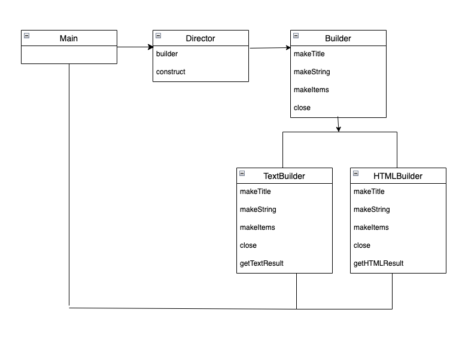
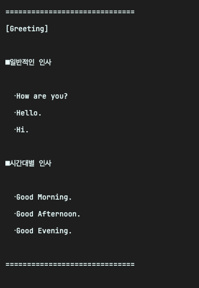

## 1\. 빌더(Builder) 패턴이란?

일반적으로 구조를 갖춘 큰 구조물을 건축, 구축하는 것을 build라고 한다

예를 들어 빌딩을 지을 때 지반다지기, 뼈대 만들기 등의 과정을 거치며 아래에서 위로 순차적으로 만들어간다. 복잡한 구조물을 단숨에 완성하기는 어렵기에, 구성하는 각 부분을 만들고 단계를 밟아가며 만들게 된다. Builder 패턴은 이처럼 구조를 가진 복잡한 인스턴스를 조립해 가는 패턴이다. 

## 2\. 빌더 패턴의 구조

<p align="center"></p>

-   **Builder 역** - 인스턴스를 결정, 인스턴스 각 부분을 만드는 메서드를 정의. 예제에서는 Builder 클래스가 역할을 맡음
-   **ConcreteBuilder 역** - 인터페이스를 구현, 실제 인스턴스 생성으로 호출되는 메서드가 여기에서 정의 TextBuilder, HTMLBuilder 클래스가 역할을 맡음
-   **Director 역**\- Builder의 인터페이스를 사용하여 인스턴스 생성한다. Concrete Builder역에 의존하지 않으며, ConcreteBuilder에 상관없이 작동하도록 Builder의 메서드만 활용한다. 예제에서는 Director클래스가 역할을 맡음

## 3\. 예제

빌더 패턴을 사용하여 문서 작성하는 프로그램을 구현해보자.

문서의 기본적인 구조는 다음과 같다.

-   타이틀을 한 개 포함
-   문자열을 몇 개 포함
-   항목을 몇개 포함

해당 구현을 빌더패턴으로 구현하기 위해 다음 클래스들을 구현해 보자. (위에서 본 클래스 다이어그램을 참고)

-   Builder 클래스 - 문서를 구성하는 메서드 결정하는 추상 클래스
-   Director 클래스- 그 메서드를 이용해 구체적인 문서 한 개 완성
-   TextBuilder - 텍스트를 이용해서 문서를 제작하는 구현 클래스
-   HTMLBuilder - HTML을 이용해서 문서 제작하는 구현 클래스

## 4\. 예제 클래스 분석

### 4-1. Builder 클래스

```
public abstract class Builder {
    public abstract void makeTitle(String title);
    public abstract void makeString(String str);
    public abstract void makeItems(String[] items);
    public abstract void close();
}
```

Builder 클래스는 문서를 만드는 메서드를 선언한 추상 클래스이다. makeTitle, makeString, makeItems는 각각 제목, 문자, 항목을 문서 안에 만들며 close메서드를 통해 문서를 최종 완성한다.

### 4-2. Director 클래스

```
public class Director {
    private final Builder builder;

    public Director(Builder builder) {
        this.builder = builder;
    }

    public void construct() {
        builder.makeTitle("Greeting");
        builder.makeString("일반적인 인사");
        builder.makeItems(new String[]{
                "How are you?",
                "Hello.",
                "Hi.",
        });
        builder.makeString("시간대별 인사");
        builder.makeItems(new String[]{
                "Good Morning.",
                "Good Afternoon.",
                "Good Evening.",
        });
        builder.close();
    }
}
```

Director 클래스는 Builder 클래스에 선언된 메서드로 문서를 제작한다. Builder 클래스는 추상 클래스이므로 인스턴스를 만들 수 없다.

Director의 생성자에 실제 전달되는 것은 Builder의 하위 클래스이고, 실제 구현체는 TextBuilder, HTMLBuilder의 인스턴스이다. 하위 클래스 종류에 따라 Director 클래스가 만들 구체적인 최종 문서형 식이 지정된다. construct 메서드는 실제로 문서를 만드는 메서드로 호출되면 문서가 생성된다.

### 4-3. TextBuilder 클래스

```
public class TextBuilder extends Builder{
    private StringBuilder sb = new StringBuilder();

    @Override
    public void makeTitle(String title) {
        sb.append("==============================\n");
        sb.append("[").append(title).append("]\n");
        sb.append("\n");
    }
    @Override
    public void makeString(String str)  {
        sb.append("■").append(str).append("\n");
        sb.append("\n");
    }

    @Override
    public void makeItems(String[] items) {
        for (String item : items) {
            sb.append("  ・").append(item).append("\n");
        }
        sb.append("\n");
    }

    @Override
    public void close() {
        sb.append("==============================\n");
    }

    public String getTextResult() {
        return sb.toString();
    }

}
```

TextBuilder 클래스는 Builder 클래스의 하위 클래스로 텍스트를 사용한 문서 생성의 각 메서드를 구체화한다.

### 4-4. HTMLBuilder 클래스

```
public class HTMLBuilder extends Builder    {
    private String filename = "untitled.html";
    private StringBuilder sb = new StringBuilder();

    @Override
    public void makeTitle(String title) {
        filename = title + ".html";
        sb.append("<html><head><title>").append(title).append("</title></head><body>\n");
        sb.append("<h1>").append(title).append("</h1>\n");
    }

    @Override
    public void makeString(String str) {
        sb.append("<p>").append(str).append("</p>\n");
    }

    @Override
    public void makeItems(String[] items)   {
        sb.append("<ul>\n");
        for (String item : items) {
            sb.append("<li>").append(item).append("</li>\n");
        }
        sb.append("</ul>/n/n");
    }

    @Override
    public void close() {
        sb.append("</body></html>\n");
    }

    public String getHTMLResult() {
        return sb.toString();
    }
}
```

HTMLBuilder 클래스는 Builder 클래스의 하위 클래스로 HTML을 사용한 문서 생성의 각 메서드를 구체화한다.

### 4-5. Main 클래스

```
public class Main {
    public static void main(String[] args)  {
        if (args.length != 1) {
            usage();
            System.exit(0);
        }

        if (args[0].equals("text")) {
            TextBuilder textBuilder = new TextBuilder();
            Director director = new Director(textBuilder);
            director.construct();
            String result = textBuilder.getTextResult();
            System.out.println(result);
        }   else if (args[0].equals("html"))    {
            HTMLBuilder htmlBuilder = new HTMLBuilder();
            Director director = new Director(htmlBuilder);
            director.construct();
            String filename = htmlBuilder.getHTMLResult();
            System.out.println("HTML파일 " + filename + " 이 작성되었습니다.");
        }else {
            usage();
            System.exit(0);
        }
    }

    public static void usage()  {
        System.out.println("Usage: java Main text 텍스트로 문서 작성");
        System.out.println("Usage: java Main html HTML로 문서 작성");
    }
}
```

빌더패턴을 테스트하기 위한 클래스로 text 문서를 선택하여 생성할 경우 다음과 같은 결과를 확인할 수 있다.

<p align="center"></p>

## 5\. 정리

빌더 패턴은 복잡한 인스턴스를 효율적으로 조립해 가는 과정이다. 예제에서 확인할 수 있는 내용 중 중요한 점은 자세한 구축과정이 Director 역할에 의해 감추어진다는 것이다. 

객체 지향에서는 "누가 무엇을 알고 있는가"가 중요하다. 빌더 패턴의 예제에서도 어느 클래스가 어떤 메서드를 사용할 수 있는지 고민해 볼 필요가 있다. 예제에선 Main 클래스의 Builder 클래스의 메서드를 직접 호출하지 않는다. Director 클래스의 construct 메서드만 호출할 뿐이고 문서가 완성된다.

Director 클래스가 알고 있는 것은 Builder 클래스이고 Director 클래스는 Builder 클래스의 메서드를 활용하여 문서를 구축한다. 자신이 실제로 사용하는 구현체 클래스가 어떤 것인지 모른다. (TextBuilder, HTMLBuilder, etc... )  그리고 이렇게 하위 클래스를 모르는 것은 쉽게 교체할 수 있기 때문에 매우 유용하게 적용될 수 있다.