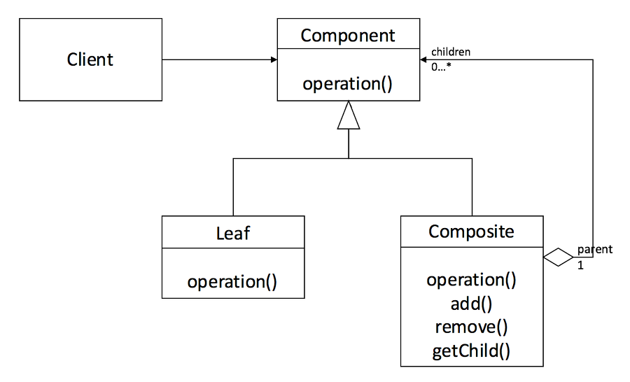

## 1\. 컴포지트(Composite) 패턴이란?

Composite는 혼합물, 복합물이란 뜻으로 중첩된 구조, 재귀적인 구조를 만드는 패턴이다. 대표적인 예로 윈도우 디렉터리와 파일을 들 수 있다. 디렉터리, 파일은 엄연히 다른 속성이지만 둘 다 디렉터리 안에 넣을 수 있다는 공통점이 있다. 디렉터리 내에는 또 다른 디렉터리가 있을 수 있기에 중첩, 재귀적인 구조를 만들어낸다.

디렉터리와 파일을 합쳐 디렉터리 엔트리라고 부르기도 한다. 두 속성을 같은 종류로 간주하는 것이다. 어떤 디렉터리 안에 무엇이 있는지 차례대로 조사할 때 조사하는 것이 디렉터리일 수도, 파일일 수도 있다, 한마디로 디렉터리 엔트리를 차례로 조사한다는 것이다.

이처럼 그릇과 내용물을 동일시하여 재귀적인 구조를 만드는 것이 Composite 패턴이다.

다이어그램을 보면서 자세히 살펴보자
<p align="center"></p>

-   **Leaf(잎) -** "내용물"로 내부에 다른 것을 넣을 수 없다.
-   **Composite(복합체)  -** "그릇"으로 Leaf나 또 다른 Composite를 넣을 수 있다.
-   **Component -** Leaf와 Composite를 동일시하는 역할을 한다. Leaf역과 Composite역에 공통되는 상위 클래스로 구현된다.
-   **Client -** Composite 패턴의 사용자이다.

다이어그램을 보면 Composite가 포함하는 Component(Leaf 나 Composite)를 부모에 대한 자식으로 간주한다. getChild() 메서드는 Component로부터 자식을 얻는 메서드이다.

## 2\. 예제

"JAVA 언어로 배우는 디자인 패턴 입문 3편"의 예제로 Composite 패턴을 구현해 보자. 처음 예시로 든 것처럼 파일/디렉터리/디렉터리 엔트리의 관계를 구현하였다.

-   **Entry -** File과 Directory를 동일시하는 추상 클래스
-   **File -** 파일 클래스
-   **Directory -** 디렉터리 클래스

### 2-1. Entry 클래스

이름과 크기를 얻기 위한 getName, getSize 메서드를 정의하고 하위 클래스에 구현을 맡긴다.  오버로딩된 printList(), printList(String) 메서드 중 printList()는 public으로 구현하여 외부에 공개하고 printList(String)은 protected로 Entry 하위 클래스에서만 사용할 수 있도록 하였다. 

```
public abstract class Entry {
    // 이름을 얻는다
    public abstract String getName();
    // 크기를 얻는다 
    public abstract int getSize();
    // 목록을 표시한다
    public void printList() {
        printList("");
    }
    // prefix를 앞에 붙여서 목록을 표시한다 
    protected abstract void printList(String prefix);
    // 문자열 표시 
    @Override
    public String toString() {
        return getName() + " (" + getSize() + ")";
    }
}
```

### 2-2. File 클래스

"파일"을 나타내는 클래스이며 Entry 하위 클래스로 선언되어 있다. getName, getSize, printList(String)을 여기서 구현한다.

```
public class File extends Entry {
    private String name;
    private int size;

    public File(String name, int size) {
        this.name = name;
        this.size = size;
    }
    @Override
    public String getName() {
        return name;
    }
    @Override
    public int getSize() {
        return size;
    }
    @Override
    protected void printList(String prefix) {
        System.out.println(prefix + "/" + this);
    }
}
```

### 2-3. Directory 클래스

"디렉터리"를 표현하는 클래스로 File클래스와 같이 Entry 클래스의 하위 클래스로 선언되어 있다. directory는 디렉터리 엔트리를 보관해 두는 필드로, List <Entry> 형으로 선언되어 있다. Entry는 파일의 인스턴스인지, 디렉터리의 인스턴스인지 알 수 없지만 getSize() 메서드를 통해 일괄적으로 파일크기를 알 수 있다. 

```
public class Directory extends Entry {
    private String name;
    private List<Entry> directory = new ArrayList<>();

    public Directory(String name) {
        this.name = name;
    }

    @Override
    public String getName() {
        return name;
    }

    @Override
    public int getSize() {
        int size = 0;
        for (Entry entry: directory) {
            size += entry.getSize();
        }
        return size;
    }

    @Override
    protected void printList(String prefix) {
        System.out.println(prefix + "/" + this);
        for (Entry entry: directory) {
            entry.printList(prefix + "/" + name);
        }
    }

    // 디렉터리 엔트리를 디렉터리에 추가한다
    public Entry add(Entry entry) {
        directory.add(entry);
        return this;
    }
}
```

다음과 같이 Directory / File 클래스(그릇과 내용물)를 같은 것으로 본다는 것이 Composite패턴의 특징이다.  add(Entry) 메서드를 통해 디렉터리 엔트리에 파일, 혹은 디렉터리를 추가하지만, 추가하는 entry가 파일인지 디렉터리인지를 세부적으로 체크하진 않는다. 또한 둘 다 Entry의 하위 클래스 인스턴스이기 때문에 getSize() 메서드를 안심하고 호출할 수 있다. Entry 하위에 새로운 클래스가 생성되어도 getSize()를 적절하게 구현할 것이기에 기존 클래스에서 이 부분을 수정할 필요가 없다.

getSize() 메서드를 자세히 살펴보면, Entry가 Directory의 인스턴스일 때 entry.getSize()를 루프를 돌며 더하며, 그 안에 디렉터리가 있으면 다시 하위 디렉터리의 getSize() 메서드를 호출한다. 이런 식으로 재귀적으로 메서드가 호출되게 되는데, Composite 패턴의 재귀적 구조가 그대로 getSize 메서드의 재귀적 호출에 대응한다는 것을 볼 수 있다.

## 3\. 결론

어디에 적용할 수 있을까? 

"JAVA 언어로 배우는 디자인 패턴 입문 3편" 도서에서는 동작테스트 시 KeyboardTest, FileTest, NetworkTest 등을 모아 InputTest로 한 번에 다루거나 매크로 명령어를 재귀적 구조로 구현하여 매크로 명령의 매크로 명령을 만드는 것을 예제로 들고 있다. 일반적인 트리구조로 된 데이터 구조는 Composite 패턴에 해당하며, 재귀적 특징을 주의해서 사용한다면 그룹과 개인이 같은 특징을 가지거나 동시에 변경할 여지가 많은 부분에 효율적으로 적용 가능하다.

블로그 : https://junhkang.tistory.com/63

참고 : JAVA 언어로 배우는 디자인 패턴 입문 3편
