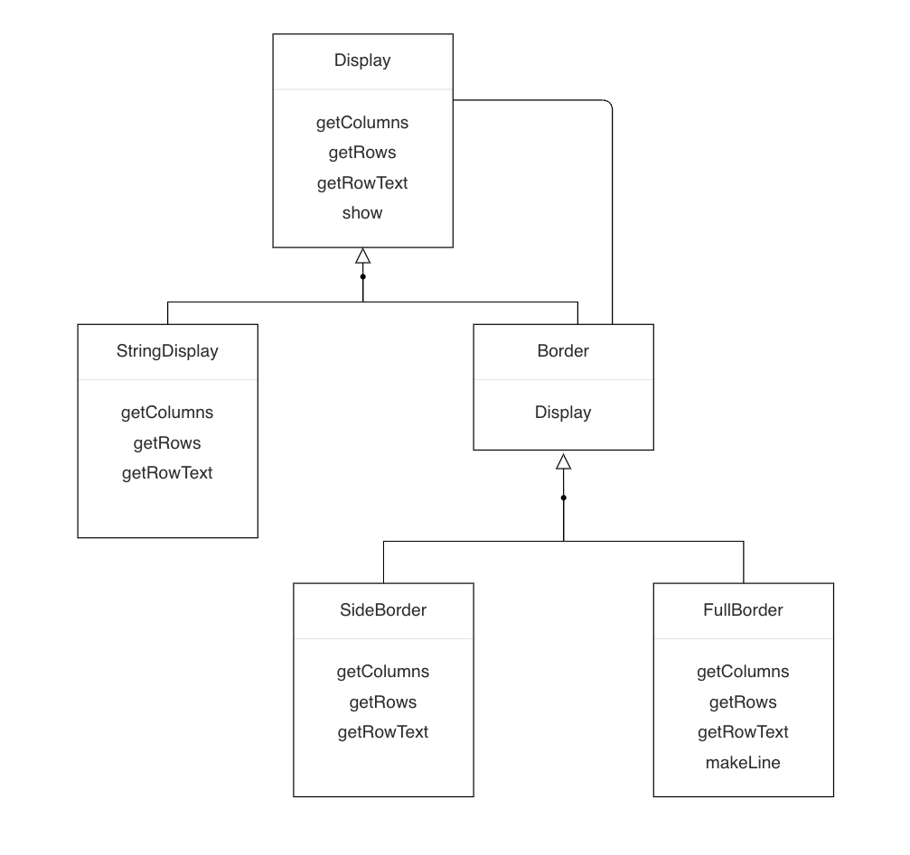

## 1\. 데코레이터(Decorator) 패턴이란?

중심이 되는 객체가 있고, 장식이 되는 기능을 하나씩 추가하여 목적에 더 맞는 객체로 만들어가는 디자인 패턴을 Decorator 패턴이라고 한다. decorator 란 "장식하는 사람"이라는 뜻이다. 예제를 통해 상세 개념을 확인해 보자. (Java언어로 배우는 디자인 패턴 입문, 3편의 예제를 그대로 사용하였다.) 적용할 예제는, 문자열 주위에 "장식틀"을 붙여 표현하는 것이다. 예를 들어 Hello World라는 기본 문구에 장식틀을 붙여 중첩 장식을 한 후 출력하는 예제이다.

```
+=============+
|Hello, world|
+=============+
```

사용될 클래스는 각각 다음과 같다.

-   **Display -** 문자열 표시용 추상 클래스
-   **StringDisplay -** 단일 행으로 구성된 문자열 표시용 클래스
-   **Border -** 장식틀 추상 클래스
-   **SideBorder -** 좌우 장식틀 클래스
-   **FullBorder -** 상하좌우 장식틀 클래스

<p align="center"></p>

각 클래스의 역할

-   **Component -**기능을 추가할 때 핵심이 되는 객체 (Display)
-   **ConcreteComponent -** Component인터페이스를 구현하는 구현체 (StringDisplay)
-   **Decorator -** Component와 동일한 인터페이스를 가지고 장식할 대상이 되는 Component도 포함(Border)
-   **ConcreteDecorator -** 구체적인 Decorator (SideBorder, FullBorder)

## 2\. 예제

### 2-1. Display 클래스

여러 행으로 이루어진 문자열을 표시하는 추상 클래스이다. 각 메서드의 역할을 살펴보면 다음과 같다.

-   **getColumns -** 가로 문자수 가져오기
-   **getRows -** 세로 문자수 가져오기
-   **getRowText -** 지정한 행의 문자열 가져오기
-   **show -** 모든 행을 표시하기 (getRow를 가져와서 for문을 돌며 getRowText 메서드로 표시할 문자열을 가져온다)

```
public abstract class Display {
    public abstract int getColumns();               // 가로 문자 수를 얻는다
    public abstract int getRows();                  // 세로 행수를 얻는다
    public abstract String getRowText(int row);     // row행째 문자열을 얻는다

    // 모든 행을 표시한다
    public void show() {
        for (int i = 0; i < getRows(); i++) {
            System.out.println(getRowText(i));
        }
    }
}
```

### 2-2. StringDisplay 클래스

Display 추상 클래스만 봐서는 이해하기 어려우므로 하위 클래스인 StringDisplay 클래스를 살펴보자. StringDisplay클래스는 장식이 들어갈 중심이 될 객체 역할이며, Display클래스에서 선언된 추상 메서드를 구현한다. 

-   **getColumns -** string.length()로 반환되는 문자열의 길이
-   **getRows -** 1을 반환
-   **getRowText -** 0번째 행의 값을 취할 때만 string 필드 반환

```
public class StringDisplay extends Display {
    private String string; // 표시 문자열 

    public StringDisplay(String string) {
        this.string = string;
    }

    @Override
    public int getColumns() {
        return string.length();
    }

    @Override
    public int getRows() {
        return 1; // 행수는 1
    }

    @Override
    public String getRowText(int row) {
        if (row != 0) {
            throw new IndexOutOfBoundsException();
        }
        return string;
    }
}
```

### 2-3. Border 클래스

문자열을 표시하는 Display클래스의 하위 클래스로 정의되어 있다. 상속에 의해 내용물과 동일한 메서드를 가지게 된다. **getColumns, getRows, getRowText, show** 메서드를 그대로 상속받으며 인터페이스(API) 관점에서 보면 장식품(Boder)이 내용물(Display)을 동일시할 수 있다는 뜻이다.

```
public abstract class Border extends Display {
    protected Display display;             // 이 장식틀이 감싸는 '내용물'

    protected Border(Display display) { // 인스턴스 생성 시 '내용물'을 인수로 지정
        this.display = display;
    }
}
```

Border는 Display 형의 display 필드를 가지고 있으면서 Border도 Display의 하위 클래스 이므로 display필드의 내용물은 또 다른 장식(Border클래스의 하위 클래스) 일 수도 있다. 그리고 그 장식 또한 display필드를 가지고 있을 수 있다.

### 2-4. SideBorder 클래스

SideBorder클래스는 구체적인 장식의 일종으로 Border클래스의 하위 클래스이다. SideBorder 클래스는 문자열 좌우에 정해진 문자로 장식한다.

-   **borderChar -** 어떤 문자로 장식할지 지정
-   **getColumns -** 표시문자의 가로 문자수 (내용물의 문자수 + 좌우 장식 문자수)
-   **getRows -** display.getRows()를 그대로 사용
-   **getRowsText -** 기존 문자열 양쪽에 borderChar를 붙인 후 반환

```
public class SideBorder extends Border {
    private char borderChar;  // 장식 문자

    // 내용물이 될 Display와 장식 문자를 지정
    public SideBorder(Display display, char ch) {
        super(display);
        this.borderChar = ch;
    }

    @Override
    public int getColumns() {
        // 문자 수는 내용물의 양쪽에 장식 문자만큼 더한 것
        return 1 + display.getColumns() + 1;
    }

    @Override
    public int getRows() {
        // 행수는 내용물의 행수와 같다 
        return display.getRows();
    }

    @Override
    public String getRowText(int row) {
        // 지정 행의 내용은 내용물의 지정 행 양쪽에 장식 문자를 붙인 것
        return borderChar + display.getRowText(row) + borderChar;
    }
}
```

### 2-5. FullBorder 클래스

FullBorder 클래스는 SideBorder 클래스와 동일하게 Border 하위 클래스이다. 예제에서는 SiderBorder이 좌우로만 문자를 장식했다면, 상하좌우를 모두 장식할 수 있으며, 장식 문자는 따로 지정할 수 없게 되어있다.

-   getRowText - Row가 0일 경우 상단 장식추가, Row숫자보다 1클경우 하단 장식 추가
-   makeLine - 지정한 문자가 연속하는 문자열을 만드는 보조 메서드

```
public class FullBorder extends Border {
    public FullBorder(Display display) {
        super(display);
    }

    @Override
    public int getColumns() {
        // 문자 수는 내용물 양쪽에 좌우 장식 문자만큼 더한 것
        return 1 + display.getColumns() + 1;
    }

    @Override
    public int getRows() {
        // 행수는 내용물의 행수에 상하 장식 문자만큼 더한 것
        return 1 + display.getRows() + 1;
    }

    @Override
    public String getRowText(int row) {
        if (row == 0) {                                                 // 상단 테두리
            return "+" + makeLine('-', display.getColumns()) + "+";
        } else if (row == display.getRows() + 1) {                  // 하단 테두리
            return "+" + makeLine('-', display.getColumns()) + "+";
        } else {                                                           // 기타
            return "|" + display.getRowText(row - 1) + "|";
        }
    }

    // 문자 ch로 count 수만큼 연속한 문자열을 만든다
    private String makeLine(char ch, int count) {
        StringBuilder line = new StringBuilder();
        for (int i = 0; i < count; i++) {
            line.append(ch);
        }
        return line.toString();
    }
}
```

### 2-6. Main

이제 샘플 코드를 실행시킬 메인 클래스를 보자

```
public static void main(String[] args) {
    Display b1 = new StringDisplay("Hello, world.");
    Display b2 = new SideBorder(b1, '#');
    Display b3 = new FullBorder(b2);
    b1.show();
    b2.show();
    b3.show();
    Display b4 =
                new SideBorder(
                    new FullBorder(
                        new FullBorder(
                            new SideBorder(
                                new FullBorder(
                                    new StringDisplay("Hello, world.")
                                ),
                                '*'
                            )
                        )
                    ),
                    '/'
                );
    b4.show();
```

예제에서 각 인스턴스의 역할을 보면

-   **b1 -** "Hellow, world"를 장식 없이 기본으로 표현
-   **b2 -** b1에 '#'으로 좌우 장식만 추가
-   **b3 -** b2에 상하좌우 전체 장식틀 추가 
-   **b4 -** "Hello, world"에 여러 겹 장식틀 추가

실행 결과를 확인해 보면 다음과 같다.

```
// b1.show()
Hello, world.					

// b2.show()
#Hello, world.#					

// b3.show()
+---------------+
|#Hello, world.#|				
+---------------+

// b4.show()
/+-------------------+/
/|+-----------------+|/
/||*+-------------+*||/
/||*|Hello, world.|*||/
/||*+-------------+*||/
/|+-----------------+|/
/+-------------------+/
```

b2, b3는 생성될 때 b1, b2를 각각 참조하는데, 서로의 관계를 확인해 보면 b1의 장식이 b2, b2의 장식이 b3인 관계가 성립한다.

## 3\. 정리

Decorator 패턴은 장식틀과 내용물을 동일시하는 디자인 패턴이다. 장식틀을 사용해서 특징을 추가하며 감싸더라도 내부 API는 가려지지 않는다는 특징이 있고(외부에서 getColumns, getRows 등의 메서드를 볼 수 있다.) 장식틀을 중첩적으로 추가하여 중심이 되는 객체를 계속해서 변경할 수 있다. 내용물과 장식틀이 동일시된다는 점에서 Composite 패턴과 유사한 점이 있지만, Decorator 패턴은 바깥 테두리를 추가함으로써 기능을 추가 나가는 것이 주된 목적이라는 점에서 다르다.

## 4\. 장점

-   **내용 변경 없이 기능 추가 가능 -** 핵심 객체에 대한 변경 없이, 장식틀을 추가하여 기능을 추가할 수 있다.
-   **단순한 구성으로 다양한 변경 가능 -** 구체적인 장식틀 (ConcreteDecorator)를 많이 준비하면 장식틀끼리 조합하여 새로운 객체를 계쏙 만들어 낼 수 있기 때문이다. 단순한 구성의 장식틀의 조합으로 다양한 기능을 추가할 수 있다.

\- 참고 : JAVA 언어로 배우는 디자인 패턴 입문 3편
