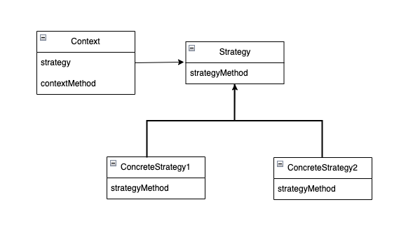

## 1\. 전략(Strategy) 패턴이란?

Strategy는 전략이라는 뜻으로 적을 해치우는 작전, 게임을 이기는 전략, 문제를 풀어나가는 방법 등의 의미가 있고, 특히 프로그래밍에서는 문제를 해결하는 방식인 "알고리즘"을 의미한다.

모든 프로그램은 문제를 해결하기 위해 존재하며, 특정 알고리즘으로 구현된다. Strategy 패턴에서는 이미 구현한 알고리즘을 쉽게 모두 교체할 수 있다. 즉, 스위치를 누르듯 쉽게 알고리즘을 바꿔서 같은 문제를 다른 방법으로 해결하기 쉽게 만들어주는 패턴이 Strategy 패턴이다.

## 2\. 전략(Strategy) 패턴의 구조

전략 패턴의 구조와 예제에서 각 요소가 어떤 역할을 하는지 간단하게 먼저 살펴보자.

<p align="center"></p>

-   **Strategy(전략) -** 전략을 사용하기 위한 인터페이스를 결정 (예제의 Strategy 인터페이스)
-   **ConcreteStrategy(구체적인 전략) -** 인터페이스를 실제로 구현, 예제의 WinningStrategy, ProbStrategy 클래스
-   **Context(문맥) -** Strategy를 직접사용, ConcreteStrategy의 인스턴스를 가지고 있다가 필요에 따라 사용 (예제의 Player)

## 3\. 예제 (가위 바위 보 게임)

책에서는 컴퓨터로 가위바위보 하는 프로그램을 예제로 들고 있다.

### 3-1. 구조

3-1-1. 전략

-   WinningStrategy - 이기면 다음에도 같은 손을 내는 방식
-   ProbStrategy - 직전 손에서 다음손을 확률적으로 계산하는 방식

3-1-2. 클래스, 인스턴스

-   Hand - 가위바위보를 내는 손 클래스
-   Strategy - 가위바위보 전략 인터페이스
-   WinningStrategy - 이기면 같은 걸 내는 전략을 타나는 클래스
-   ProbStrategy - 직전손에서 다음손을 확률적으로 계산하는 클래스
-   Player - 가위바위보를 하는 플레이어 클래스

### 3-2. Hand enum

가위바위보를 어떤 걸 내는지를 나타나는 Hand 클래스부터 살펴보자

```
public enum Hand {
    // 가위 바위 보를 나타내는 세 개의 enum 상수
    ROCK("바위", 0),
    SCISSORS("가위", 1),
    PAPER("보", 2);

    // enum이 가진 필드 
    private String name; // 가위 바위 보 손의 이름
    private int handvalue; // 가위 바위 보 손의 값 

    // 손의 값으로 상수를 얻기 위한 배열
    private static Hand[] hands = {
        ROCK, SCISSORS, PAPER
    };

    // 생성자 
    private Hand(String name, int handvalue) {
        this.name = name;
        this.handvalue = handvalue;
    }

    // 손의 값으로 enum 상수를 가져온다 
    public static Hand getHand(int handvalue) {
        return hands[handvalue];
    }

    // this가 h보다 강할 때 true
    public boolean isStrongerThan(Hand h) {
        return fight(h) == 1;
    }

    // this가 h보다 약할 때 true
    public boolean isWeakerThan(Hand h) {
        return fight(h) == -1;
    }

    // 무승부는 0, this가 이기면 1, h가 이기면 -1
    private int fight(Hand h) {
        if (this == h) {
            return 0;
        } else if ((this.handvalue + 1) % 3 == h.handvalue) {
            return 1;
        } else {
            return -1;
        }
    }

    // 가위 바위 보의 문자열 표현
    @Override
    public String toString() {
        return name;
    }
}
```

-   **Hand -** 가위/바위/보를 내는 손 자체를 나타내는 enum으로 각 행위를 enum 상수로 나타내고 getHand 메서드를 사용하여 Hand의 인스턴스를 얻을 수 있다. 예를 들어 가위 바위 보(0,1,2)를 각각 인수로 주면 값에 대응하는 인스턴스가 반환된다.
-   **isStrongerThan, isWeakerThan -** Hand형인 두 손 객체의 강약을 비교한다.
-   **fight -** 실제 손의 강약 판정한다. 예제에서는 두 손의 합으로 승패를 구분하는데, 가위 바위 보 가 각각 0/1/2 이기에 합을 3으로 나눈 값을 기준으로 승패를 판별할 수 있다.

### 3-3. Strategy 인터페이스

가위바위보 전략을 위한 추상 메서드의 집합체이다.

```
public interface Strategy {
    public abstract Hand nextHand();
    public abstract void study(boolean win);
}
```

-   nextHand - 다음에 낼 손을 얻기 위한 메서드
-   study - 직전에 맨손으로 이겼는지 졌는지를 학습하는 메서드

직전 nextHand 메서드 호출에서 이긴 경우 study(true), 지면 study(false)를 각각 호출한다. 이에 따라 Strategy 인터페이스를 구현하는 클래스는 자신의 내부상태를 변화시키고 다음에 낼 nextHand의 반환 값을 결정한다.

### 3-4. WinningStrategy 클래스

Strategy 인터페이스를 구현하는 클래스 중 하나로 nextHand, study 두 메서드를 구현한다.

```
public class WinningStrategy implements Strategy {
    private Random random;
    private boolean won = false;
    private Hand prevHand;

    public WinningStrategy(int seed) {
        random = new Random(seed);
    }

    @Override
    public Hand nextHand() {
        if (!won) {
            prevHand = Hand.getHand(random.nextInt(3));
        }
        return prevHand;
    }

    @Override
    public void study(boolean win) {
        won = win;
    }
}
```

이 클래스는 이전 승부가 이겼다면 다음번에 같은 걸 다시 내는 전략을 구현한 클래스이다. 만약 승부에 졌다면 다음은 랜덤 하게 낸다. won필드에는 이전 승부의 결과를 보관하며 이기면 true, 지면 false가 된다. preHand필드에는 이전 승부에서 낸 손 보관한다.

### 3-5. ProbStrategy 클래스

Strategy 인터페이스를 구현하는 또 하나의 구체적인 전략 클래스로, nextHand, study 두 메서드를 구현한다.

```
public class ProbStrategy implements Strategy {
    private Random random;
    private int prevHandValue = 0;
    private int currentHandValue = 0;
    private int[][] history = {
        { 1, 1, 1, },
        { 1, 1, 1, },
        { 1, 1, 1, },
    };

    public ProbStrategy(int seed) {
        random = new Random(seed);
    }

    @Override
    public Hand nextHand() {
        int bet = random.nextInt(getSum(currentHandValue));
        int handvalue = 0;
        if (bet < history[currentHandValue][0]) {
            handvalue = 0;
        } else if (bet < history[currentHandValue][0] + history[currentHandValue][1]) {
            handvalue = 1;
        } else {
            handvalue = 2;
        }
        prevHandValue = currentHandValue;
        currentHandValue = handvalue;
        return Hand.getHand(handvalue);
    }

    private int getSum(int handvalue) {
        int sum = 0;
        for (int i = 0; i < 3; i++) {
            sum += history[handvalue][i];
        }
        return sum;
    }

    @Override
    public void study(boolean win) {
        if (win) {
            history[prevHandValue][currentHandValue]++;
        } else {
            history[prevHandValue][(currentHandValue + 1) % 3]++;
            history[prevHandValue][(currentHandValue + 2) % 3]++;
        }
    }
}
```

다음에 낼 손을 난수로 결정하고, 과거의 이기고 진 이력을 활용해서 확률을 바꾸는 전략을 구현한 클래스이다.

history 필드는 과거 승패를 반영한 확률 계산을 위한 2차원 배열이다.

> history \[직전에 낸 손\] \[이번에 낼 손\] = 승리한 횟수
>
> ex)  
> history \[0\]\[1\] - 바위, 바위를 냈을 때 승수  
> history \[0\]\[0\]- 바위, 가위를 냈을 때 승수  
> ...
>

즉, 직전에 바위를 냈다면 history \[0\]의 배열의 승수를 비율을 통해 서로 다른 비율로 손을 결정한다. 예를 들어 처음 바위를 냈을 때 이긴 승수가 다음과 같다면

> history \[0\]\[0\] = 3  
> history \[0\]\[1\] = 2  
> history \[0\]\[2\] = 5

전체 승수 10 대비 각 손을 냈을 때의 승률을 기준으로 다음 손을 결정한다. (ex. 바위를 다시 낼 확률 = 3/10)

### 3-6. Player 클래스

가위바위보를 하는 사람을 나타내는 클래스로 이름과 전략으로 인스턴스가 생성된다.

```
public class Player {
    private String name;
    private Strategy strategy;
    private int wincount;
    private int losecount;
    private int gamecount;

    // 이름과 전략을 받아서 플레이어를 만든다 
    public Player(String name, Strategy strategy) {
        this.name = name;
        this.strategy = strategy;
    }

    // 전략에 따라 다음 손을 결정한다
    public Hand nextHand() {
        return strategy.nextHand();
    }

    // 승리
    public void win() {
        strategy.study(true);
        wincount++;
        gamecount++;
    }

    // 패배
    public void lose() {
        strategy.study(false);
        losecount++;
        gamecount++;
    }

    // 무승부 
    public void even() {
        gamecount++;
    }

    @Override
    public String toString() {
        return "["
            + name + ":"
            + gamecount + " games, "
            + wincount + " win, "
            + losecount + " lose"
            + "]";
    }
}
```

nextHand메서드는 자신의 전략을 Strategy에 위임하고 있다. 승부 결과를 다음 승부에 활용하고자 Strategy필드를 통해 study메서드를 호출하고, study 메서드로 전략의 내부상태를 변화시킨다.

### 3-7. Main

이제 실제 다른 전략의 플레이들로 가위바위보를 하는 메인 클래스를 생성해 보자

```
public class Main {
    public static void main(String[] args) {
        if (args.length != 2) {
            System.out.println("Usage: java Main randomseed1 randomseed2");
            System.out.println("Example: java Main 314 15");
            System.exit(0);
        }
        int seed1 = Integer.parseInt(args[0]);
        int seed2 = Integer.parseInt(args[1]);
        Player player1 = new Player("KIM", new WinningStrategy(seed1));
        Player player2 = new Player("LEE", new ProbStrategy(seed2));
        for (int i = 0; i < 10000; i++) {
            Hand nextHand1 = player1.nextHand();
            Hand nextHand2 = player2.nextHand();
            if (nextHand1.isStrongerThan(nextHand2)) {
                System.out.println("Winner:" + player1);
                player1.win();
                player2.lose();
            } else if (nextHand2.isStrongerThan(nextHand1)) {
                System.out.println("Winner:" + player2);
                player1.lose();
                player2.win();
            } else {
                System.out.println("Even...");
                player1.even();
                player2.even();
            }
        }
        System.out.println("Total result:");
        System.out.println(player1);
        System.out.println(player2);
    }
}
```

두 명의 플레이어를 각각 다른 Strategy 구현체로 생성한 후 서로 가위바위보를 시키는 클래스이다.

## 4\. Strategy(전략) 패턴의 장점 및 정리

Strategy 패턴은 알고리즘을 다른 부분과 의도적으로 분리한다. 얼핏 보면 불필요하고 복잡한 구조를 오히려 만드는 것 같지만 그렇지 않다.

인터페이스만 정의하고 위임을 통해 약한 결합으로 알고리즘을 사용하기에 알고리즘을 용이하게 전환할 수 있고, 알고리즘을 변경해야 하는 경우 ConcreteStrategy만 수정하면 된다.

또한 전략패턴을 사용 시 프로그램을 실행 중에 ConcreteStrategy 역을 전환할 수도 있다. 전략을 캡슐화하고 이를 사용하는 콘텍스트에서 독립적으로 전략을 변경해 줄 수 있기 때문이고, 실행 중인 애플리케이션 내에서 사용자 선택이나 조건에 따라 정렬방식/암호화/난수생성 등의 전략을 바꿀 수 있기 때문에 유연성과 확장성이 올라간다.


* 참고 : JAVA 언어로 배우는 디자인 패턴 입문 3편

* 블로그 : https://junhkang.tistory.com/87 
